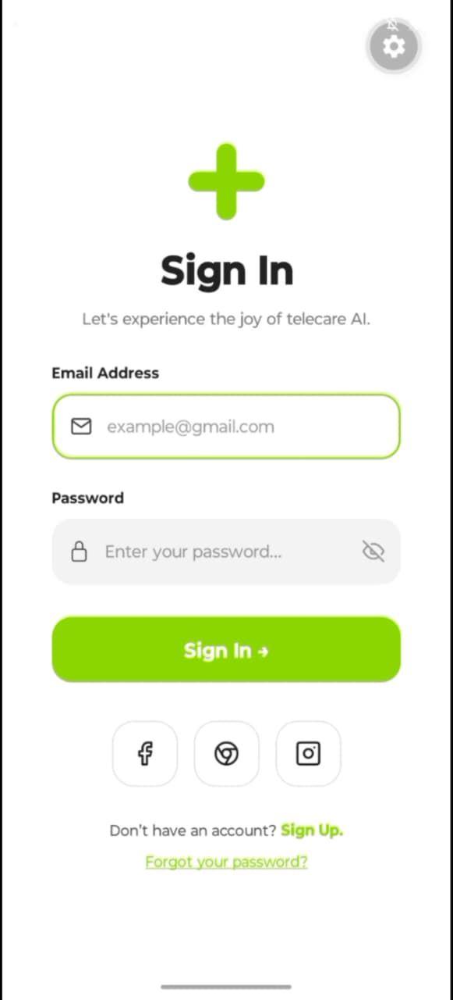

Login UI – React Native (Expo)

A modern and clean **React Native Login UI** built with **Expo**.  
This project recreates a smooth mobile authentication screen with custom styling, rounded inputs, social login buttons, and a minimalist medical-style logo.

---

## 📱 App Preview



---

## ✨ Features

- Clean modern UI
- Built using React Native + Expo
- Custom logo design
- Email & Password fields
- Social login buttons
- Rounded modern components
- Beginner-friendly project structure
- Responsive mobile layout

---

## 🚀 Tech Stack

- React Native
- Expo
- Expo Vector Icons

---

## 📦 Installation

Clone the repository:

```bash
git clone https://github.com/your-username/telecare-ui.git
```

Go into the project folder:

```bash
cd telecare-ui
```

Install dependencies:

```bash
npm install
```

Start Expo server:

```bash
npx expo start
```

---

## 🛠 Dependencies

Install icons package:

```bash
npx expo install @expo/vector-icons
```

---

## 🎯 Learning Goals

This project helps beginners learn:

- React Native fundamentals
- Flexbox layouts
- Styling in React Native
- TextInput handling
- Buttons and touchables
- Mobile UI design
- Component structuring

---

